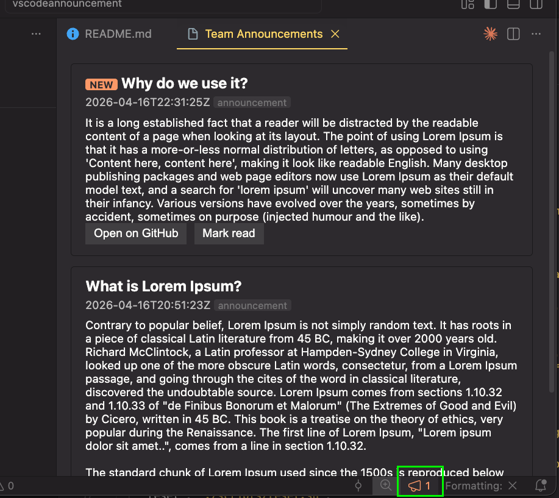
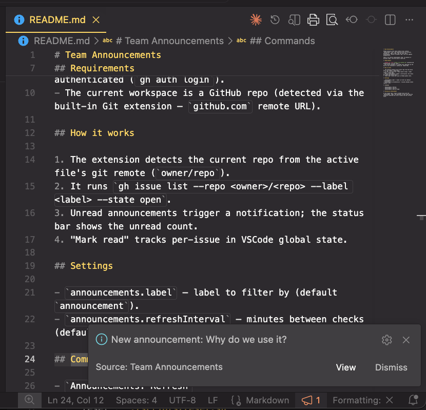
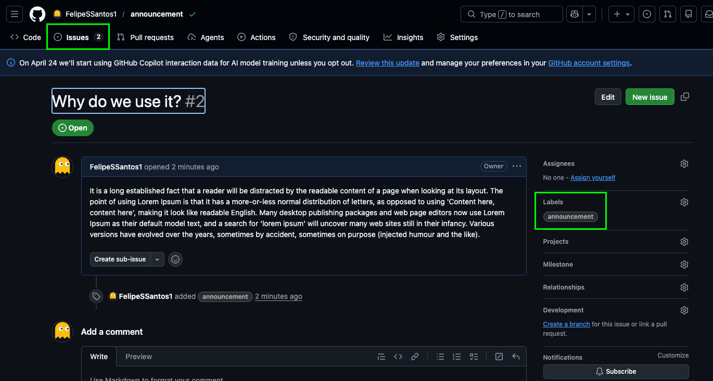
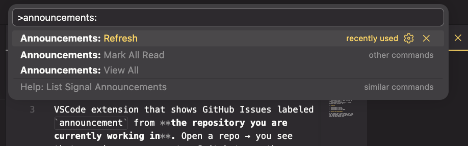

# Team Announcements

VSCode extension that shows GitHub Issues labeled `announcement` from **the repository you are currently working in**. Open a repo → you see that repo's announcements. Switch to another repo → the list updates automatically.

There is no central announcements repo. To announce in multiple repos, file the issue in each one.

## Screenshots

## Requirements

- [GitHub CLI (`gh`)](https://cli.github.com) installed and authenticated (`gh auth login`).
- The current workspace is a GitHub repo (detected via the built-in Git extension — `github.com` remote URL).

## How it works

1. The extension detects the current repo from the active file's git remote (`owner/repo`).
2. It runs `gh issue list --repo <owner>/<repo> --label <label> --state open`.
3. Unread announcements trigger a notification; the status bar shows the unread count.
4. "Mark read" tracks per-issue in VSCode global state.

## Settings

- `announcements.label` — label to filter by (default `announcement`).
- `announcements.refreshInterval` — minutes between checks (default `30`).

## Commands

- `Announcements: Refresh`
- `Announcements: View All`
- `Announcements: Mark All Read`

## Posting an announcement

In the target repo, create a GitHub Issue with the `announcement` label. Any developer on that repo with the extension installed will see it within the next refresh cycle.
